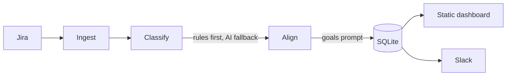

# Teamscope

Team goal-alignment and work-mix observability. Teamscope ingests Jira epics
per team, classifies each into **business / chore / R&D**, scores how well it
serves your declared goals, and renders an at-a-glance dashboard so you can tell
in a moment whether teams are working on aligned goals.

It combines two signals:

- **Observability** — epic progress, delivery status, and the business/chore/R&D mix over time (persisted in SQLite).
- **AI** — Anthropic classifies ambiguous work and scores alignment against a human-written goals prompt.



## How it classifies

Each epic is tagged into one of three fixed buckets using, in priority order:

1. **Jira labels** (a label literally named `business` / `chore` / `rnd`)
2. **Components**
3. **Title/description keywords** (configurable under `[classify]`)
4. **Anthropic** fallback, only when no rule matches

Unmatched epics with no AI configured default to `chore`.

## How it scores alignment

You provide a free-text **goals prompt** under `[goals]`. Anthropic judges each
epic against it as `aligned`, `partial`, or `off_track`, with a short note.
Alignment is best-effort: if the AI is unavailable, the snapshot still stores
progress and work-mix data.

## Usage

```sh
# Build
go build -o teamscope .

# Configure
cp teamscope-config.toml.template teamscope-config.toml
# ...edit credentials, teams, goals...

# Take a snapshot per team (and post to Slack if configured)
./teamscope --config teamscope-config.toml snapshot

# Render the dashboard
./teamscope --config teamscope-config.toml serve --out dashboard.html   # static file
./teamscope --config teamscope-config.toml serve --addr :8080           # http server
```

Run `snapshot` on a schedule (cron/CI) to build up trend history.

## Configuration

See `teamscope-config.toml.template` for the full annotated reference. Minimum
required: `[jira] base_url`, one `[[teams]]` entry with `jira_projects`, and
`[store] path`. Anthropic, Slack, GitHub, and goals are optional.

## State

Snapshots are stored in a single SQLite file (`[store] path`). Each snapshot
records the per-team work-mix percentages plus per-epic classification,
alignment, progress, and status.
