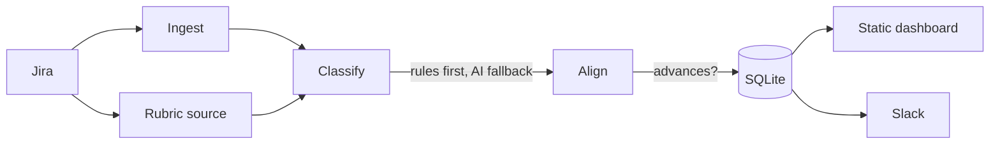

# Teamscope

Team goal-alignment observability. Teamscope ingests Jira epics per team, maps
each onto the team's **rubric** — a named set of criteria — and judges whether
it advances that criterion, then renders an at-a-glance dashboard so you can
tell in a moment whether teams are working on aligned goals and where work is
drifting.

A rubric is deliberately generic: it can be a product-readiness framework, a
business/chore/R&D split, or any set of goals you define. The engine never
hardcodes what the criteria mean.

It combines two signals:

- **Observability** — epic progress, delivery status, per-criterion coverage, and lens split over time (persisted in SQLite).
- **AI** — Anthropic maps ambiguous epics to the best-fitting criterion and scores whether each epic advances it.



## Rubrics

Each team references a rubric by name. Rubrics come from a pluggable **source**:

- **`static`** — criteria are listed inline in config (e.g. business / chore / rnd). Deterministic, no AI.
- **`jira_label`** — every epic carrying a label in a project becomes one criterion (e.g. a readiness framework tracked as labelled epics). Fully automated from Jira, no AI.

A future `confluence` source (AI-parsed readiness pages) plugs in behind the
same interface.

## How epics are mapped

Each epic is mapped to the single criterion it best serves, using — in priority
order:

1. **Jira labels** matching a criterion key
2. **Components** matching a criterion key
3. **Keyword hints** (`[[rubrics.keyword_hints]]`)
4. **Anthropic** semantic mapping, only when no rule matches

Epics that map to nothing are surfaced as **unmapped** (work serving no declared
goal). With no AI configured, only the deterministic rules run.

## What the report shows

- **Coverage** — for each criterion, how many active epics advance it.
- **Drift** — open criteria that no active epic is advancing.
- **Blocker focus** — share of work aimed at unfinished goals rather than done ones.
- **Lens split** — product / business / operations breakdown.
- **Unmapped** — epics not serving any criterion.

## Usage

```sh
# Build
go build -o teamscope .

# Configure
cp teamscope-config.toml.template teamscope-config.toml
# ...edit credentials, rubrics, teams...

# Take a snapshot per team (and post to Slack if configured)
./teamscope --config teamscope-config.toml snapshot

# Render the dashboard
./teamscope --config teamscope-config.toml serve --out dashboard.html   # static file
./teamscope --config teamscope-config.toml serve --addr :8080           # http server
```

Run `snapshot` on a schedule (cron/CI) to build up trend history.

## Configuration

See `teamscope-config.toml.template` for the full annotated reference. Minimum
required: `[jira] base_url`, at least one `[[rubrics]]`, and one `[[teams]]`
entry with `jira_projects` and a `rubric` reference, plus `[store] path`.
Anthropic, Slack, and GitHub are optional.

The AI stage can run through the Anthropic API (`[anthropic]`, needs an API
token) or through Amazon Bedrock (`[bedrock]`, needs only AWS credentials via
the standard credential chain — env vars, shared config profile, or an IAM
role). If both are configured, Bedrock takes priority.

## State

Snapshots are stored in a single SQLite file (`[store] path`). Each snapshot
records the resolved rubric criteria, the per-criterion mix, and per-epic
criterion mapping, advancement, lens, progress, and status.
