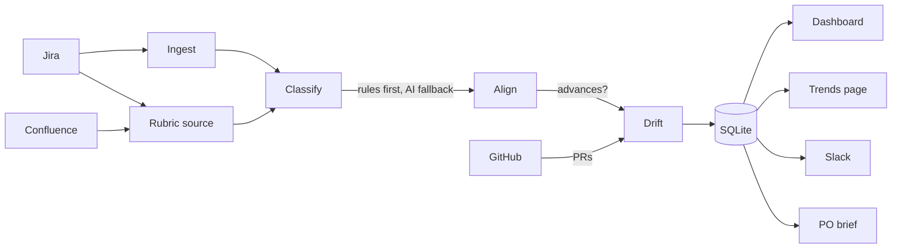

# Teamscope

Team goal-alignment observability. Teamscope ingests Jira epics per team, maps
each onto the team's **rubric** — a named set of criteria — and judges whether
it advances that criterion, then renders an at-a-glance dashboard so you can
tell in a moment whether teams are working on aligned goals and where work is
drifting.

A rubric is deliberately generic: it can be a product-readiness framework, a
business/chore/R&D split, or any set of goals you define. The engine never
hardcodes what the criteria mean.

It combines three signals:

- **Observability** — epic progress, delivery status, per-criterion coverage, drift, and trend history over time (persisted in SQLite).
- **AI** — Anthropic maps ambiguous epics to the best-fitting criterion, scores advancement, and writes a PO-style progress brief with an action plan.
- **GitHub** — merged PR counts per team's repos as a secondary activity signal.



## Rubrics

Each team references a rubric by name. Rubrics come from a pluggable **source**:

- **`static`** — criteria are listed inline in config (e.g. business / chore / rnd). Deterministic, no AI.
- **`jira_label`** — every epic carrying a label in a project becomes one criterion (e.g. a readiness framework tracked as labelled epics). Fully automated from Jira, no AI.
- **`confluence`** — an AI-backed source that reads a product-readiness Confluence page and extracts its pillars as criteria. Each pillar becomes a criterion with its RAG status. Tolerates free-form page structure.

## How epics are mapped

Each epic is mapped to the single criterion it best serves, using — in priority
order:

1. **Jira labels** matching a criterion key
2. **Components** matching a criterion key
3. **Keyword hints** (`[[rubrics.keyword_hints]]`)
4. **Anthropic** semantic mapping (batched, 50 epics per AI call), only when no rule matches

Epics that map to nothing are surfaced as **unmapped** (work serving no declared
goal). With no AI configured, only the deterministic rules run.

## Drift check

For teams using Confluence readiness rubrics, teamscope reconciles the page's
hand-set RAG against live Jira ticket status:

- **Optimistic** — page says done, but tickets are still open
- **Stale** — page says gap, but tickets are actually done
- **None** — page and tickets agree

Tickets are attributed to pillars via text proximity (deterministic fallback)
or AI mapping. Pillar cards with drift are highlighted with colored borders.

## What the dashboard shows

- **PO brief** — an AI-written progress brief per team with a SUMMARY section and a numbered ACTION PLAN referencing specific tickets and pillars.
- **Pillar cards** — each criterion as a card with RAG status, drift badge, epic coverage, and linked tickets.
- **Drift highlighting** — pillar cards with optimistic drift get yellow borders; stale drift gets purple.
- **Unmapped section** — collapsible list of epics serving no declared goal, with Jira links.
- **Coverage table** — for each criterion: status, advancing count, and share.
- **Epic table** — all epics with criterion, advancement verdict, status, progress bar, and expandable child tickets.
- **GitHub badges** — PR counts per team (last 90 days).
- **Trends page** — SVG filled line charts showing epic count, blocker focus, drift count, and unmapped count over time. Includes the latest PO brief per team.

## Usage

```sh
# Build
go build -o teamscope .

# Configure
cp teamscope-config.toml.template teamscope-config.toml
# ...edit credentials, rubrics, teams...

# Take a snapshot per team (and post to Slack if configured)
./teamscope --config teamscope-config.toml snapshot

# Render the dashboard
./teamscope --config teamscope-config.toml serve --out dashboard.html   # static file
./teamscope --config teamscope-config.toml serve --addr :8080           # http server
```

The dashboard has two pages:
- `/` — current snapshot per team
- `/trends` — SVG charts over time (run snapshots daily to build history)

Run `snapshot` on a schedule (cron/CI) to build up trend history.

## Configuration

See `teamscope-config.toml.template` for the full annotated reference. Minimum
required: `[jira] base_url`, at least one `[[rubrics]]`, and one `[[teams]]`
entry with `jira_projects` and a `rubric` reference, plus `[store] path`.

Optional:
- **`[anthropic]`** — AI classification, advancement scoring, drift attribution, and PO narrative. Needs an API token.
- **`[bedrock]`** — alternative AI backend via Amazon Bedrock. Needs only AWS credentials via the standard credential chain. Takes priority over `[anthropic]` when configured.
- **`[github]`** — PR activity per team. Add `github_repos` to each team to enable.
- **`[slack]`** — posts a summary per team when configured.

## State

Snapshots are stored in a single SQLite file (`[store] path`). Each snapshot
records the resolved rubric criteria, per-criterion mix, per-epic criterion
mapping and advancement, drift states with linked tickets, GitHub activity,
and the PO narrative. Schema migrations run automatically on startup.
